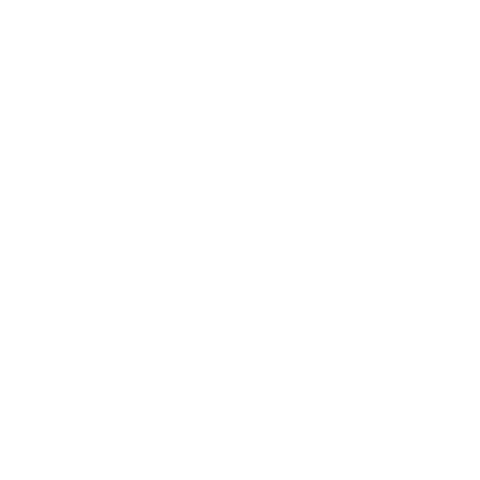
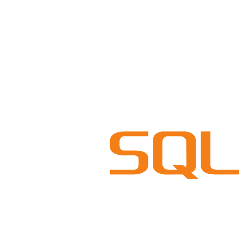

# Hi there, I'm Alif Rayhan👋

I'm a passionate **Full-Stack Web Developer** specializing in the **MERN Stack (MongoDB, Express.js, React.js, Node.js)**. My focus is on creating clean, responsive, and highly user-friendly websites and applications.

## Current Focus:

- Building scalable, real-world applications
- Performance Optimization
- Advanced React patterns
- Secure API development

## I'm Open To:

- Collaboration
- Full-Stack Projects
- Freelance Work
- Open-Source Contributions

## Skills:

### Languages:

  <a href="https://www.typescriptlang.org/" target="_blank" class="logo-style typescript">
    
    TypeScript
  </a>
  <a href="https://developer.mozilla.org/en-US/docs/Web/JavaScript" target="_blank" class="logo-style javascript">
    
    JavaScript
  </a>
  <a href="https://developer.mozilla.org/en-US/docs/Web/HTML" target="_blank" class="logo-style html">
    
    HTML
  </a>
  <a href="https://developer.mozilla.org/en-US/docs/Web/CSS" target="_blank" class="logo-style css">
    
    CSS
  </a>
  <a href="https://www.markdownguide.org/" target="_blank" class="logo-style markdown">
    
    Markdown
  </a>
  <a href="https://www.gnu.org/software/bash/" target="_blank" class="logo-style bash">
    
    Shell Script
  </a>

### Frontend Development:

  <a href="https://react.dev/" target="_blank" class="logo-style react">
    
    React
  </a>
  <a href="https://nextjs.org/" target="_blank" class="logo-style nextjs">
    
    Next.js
  </a>
  <a href="https://redux.js.org/" target="_blank" class="logo-style redux">
    
    Redux
  </a>
  <a href="https://reactrouter.com/" target="_blank" class="logo-style react-router">
    
    React Router
  </a>
  <a href="https://tailwindcss.com/" target="_blank" class="logo-style tailwindcss">
    
    Tailwind CSS
  </a>
  <a href="https://ui.shadcn.com/" target="_blank" class="logo-style shadcn">
    
    Shadcn/ui
  </a>

### Backend Development:

  <a href="https://nodejs.org/" target="_blank" class="logo-style nodejs">
    
    Node.js
  </a>
  <a href="https://expressjs.com/" target="_blank" class="logo-style express">
    
    Express.js
  </a>
    <a href="https://nextjs.org/" target="_blank" class="logo-style nextjs">
    
    Next.js
  </a>
  <a href="https://firebase.google.com/" target="_blank" class="logo-style firebase">
    
    Firebase
  </a>

### Database:

  <a href="https://www.mongodb.com/" target="_blank" class="logo-style mongodb">
    
    MongoDB
  </a>
  <a href="https://www.mysql.com/" target="_blank" class="logo-style mysql">
    
    MySQL
  </a>
  <a href="https://www.prisma.io/" target="_blank" class="logo-style prisma">
    
    Prisma
  </a>

### Tools & Technologies:

  <a href="https://git-scm.com/" target="_blank" class="logo-style git">
    
    Git
  </a>
  <a href="https://www.postman.com/" target="_blank" class="logo-style postman">
    
    Postman
  </a>
  <a href="https://www.netlify.com/" target="_blank" class="logo-style netlify">
    
    Netlify
  </a>
  <a href="https://vercel.com/" target="_blank" class="logo-style vercel">
    
    Vercel
  </a>
  <a href="https://www.docker.com/" target="_blank" class="logo-style docker">
    
    Docker
  </a>
  <a href="https://www.figma.com/" target="_blank" class="logo-style figma">
    
    Figma
  </a>

### Connect with Me:

  <a href="mailto:alifrayhandev@gmail.com" target="_blank" class="logo-style email">
    
    Email
  </a>
  <a href="https://linkedin.com/in/alifrayhandev" target="_blank" class="logo-style linkedin">
    
    LinkedIn
  </a>
  <a href="https://twitter.com/alifrayhandev" target="_blank" class="logo-style twitter">
    
    Twitter
  </a>
  <a href="https://discord.gg/mkEHmCZf" target="_blank" class="logo-style discord">
    
    Discord
  </a>

  You wanna know more about me?

 

A lifelong learner with a passion for technology and discovery. I love exploring new ideas, solving problems, and constantly improving myself.

Outside of coding, I’m also a Math teacher. Teaching math allows me to inspire curiosity, simplify complex concepts, and help students develop problem-solving skills that extend beyond the classroom. Sharing knowledge and seeing others grow is one of my greatest joys.

Curious, motivated, and always ready to take on new challenges.

#### Github Stats

